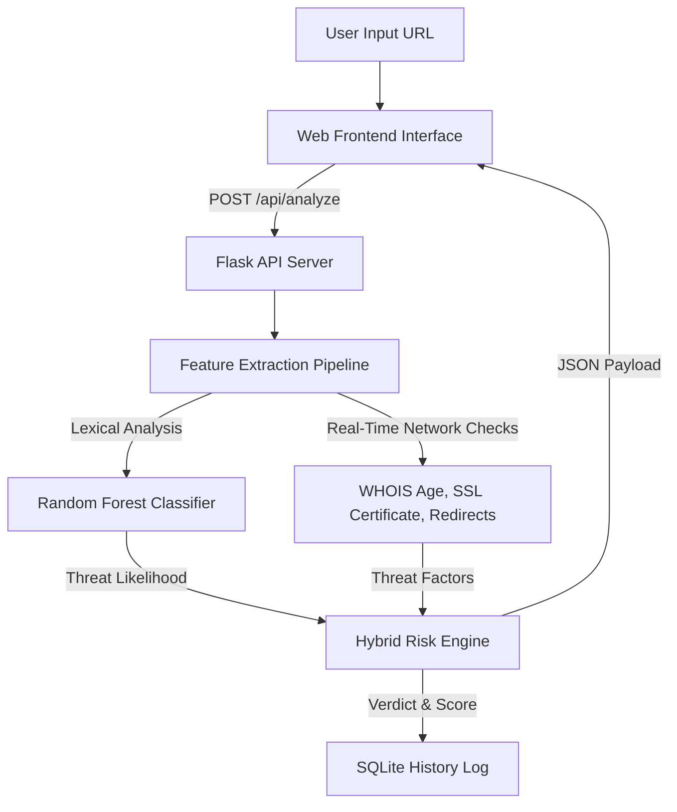

# PhishShield // AI-Powered Phishing URL Detection System

PhishShield is a full-stack, real-time cyber threat intelligence system that analyzes web addresses (URLs) and predicts whether they are legitimate, suspicious, or active phishing threats. The system combines an offline-trained **Random Forest Classifier** with real-time security heuristics (SSL validation, domain age WHOIS lookup, redirection paths) to compute a robust threat score.

---

## System Architecture



---

## Machine Learning & Evaluation Metrics

The classifier was trained on a balanced sample of **10,000 URLs** (5,000 legitimate, 5,000 phishing) sourced from threat directories.

### Features Extracted

1. **Lexical Features (100% offline & fast)**:
   * **URL Length**: Character count of the address (longer URLs correlate with obfuscated structures).
   * **Dot Count**: Number of periods in the URL.
   * **Subdomain Count**: Extracted from the hostname (e.g. brand spoofing patterns).
   * **At-Symbol (`@`) Presence**: Indicates spoofing parameters where credentials precede hostnames.
   * **Dash (`-`) Presence**: Indicates dashes commonly injected in brand names.
   * **Double Slash (`//`) in Path**: Detects internal page redirects.
   * **IP Hostname**: Detects numerical host addresses bypassing DNS checks.
   * **Shortener Service**: Flags redirection services (`bit.ly`, `tinyurl.com`, etc.).
   * **Insecure HTTP Protocol**: Checks if HTTPS is disabled.
   * **Suspicious Keywords**: Scans for keywords like `login`, `verify`, `secure`, `update`, `signin`, `wallet`, etc.

2. **Security & Domain Features (Live Network Checks)**:
   * **SSL Certificate Validity**: Verifies HTTPS SSL handshakes.
   * **Domain Age (WHOIS)**: Age of domain registration in days (new domains are high-risk).
   * **Redirect Count**: Tracks the number of redirection hops.

### Model Metrics (Random Forest Classifier)

* **Accuracy**: `69.90%`
* **Precision**: `72.84%`
* **Recall**: `62.21%`
* **F1-Score**: `67.10%`

*Note: Since historical phishing domains are taken down rapidly, the Random Forest model was trained on lexical attributes to remain robust offline, while the Flask endpoint layers live WHOIS registry queries and SSL validations as deterministic risk adjustments.*

---

## File Structure

```
phishing-detector/
├── backend/
│   ├── app.py                  # Flask API Server & SQLite DB logging
│   ├── feature_extraction.py   # Feature extraction algorithms (lexical & network)
│   ├── train_model.py          # Data downloading, parsing, and model training
│   ├── model.pkl               # Pickled Random Forest estimator
│   ├── requirements.txt        # Backend dependencies
│   ├── test_pipeline.py        # Feature extraction unit tests
│   └── test_api_client.py      # Integration testing client
├── frontend/
│   ├── index.html              # Cyberpunk dark dashboard SPA
│   ├── style.css               # Styling, Glassmorphism, animations, responsive design
│   └── script.js               # SVG Gauge manipulation, API calls, history CRUD
└── data/
    └── phishing_dataset.csv    # Locally saved training subset (10,000 URLs)
```

---

## Setup & Run Instructions

### Prerequisites
* Python 3.8+ (Verified on Python 3.14.5)
* Node.js (or any simple local HTTP server for loading the frontend, or simply double-clicking `index.html`)

### 1. Backend Setup

From your terminal, navigate to the project directory and set up a virtual environment:

```bash
# Create virtual environment
python -m venv .venv

# Activate virtual environment
# On Windows (PowerShell):
.venv\Scripts\Activate.ps1
# On Windows (cmd):
.venv\Scripts\activate.bat
# On macOS/Linux:
source .venv/bin/activate

# Install requirements
pip install -r backend/requirements.txt
```

### 2. Model Training

Train the classifier to output `model.pkl` and save `phishing_dataset.csv` locally:

```bash
python backend/train_model.py
```

### 3. Running Backend Server

Start the Flask server on `http://127.0.0.1:5000`:

```bash
python backend/app.py
```

### 4. Running Frontend Client

To view the dashboard, you can simply double-click `frontend/index.html` to open it in a browser, or run a simple local web server:

```bash
# Example using Python's http.server:
python -m http.server 8000 --directory frontend
```
Then navigate to `https://srnvs-phishing-system.vercel.app/` in your web browser.

---

## Verification & Testing

To run automated checks:

```bash
# Run feature extraction unit tests
python backend/test_pipeline.py

# Run API endpoint integration tests (requires app.py server to be running)
python backend/test_api_client.py
```
